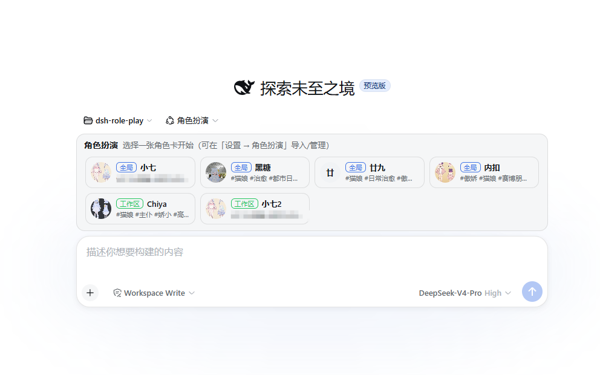

# dsh-roleplay

[](https://www.npmjs.com/package/dsh-roleplay)

English | [简体中文](README.md)

- DeepSeek Harness role-play plugin




# Features

- Character card generation / import, with interactive character card creation

- Image generation, supporting:
  - Official NAI API
  - ai.erp.sex third-party API
  - Local Stable Diffusion WebUI API


# Requirements

- [dsh](https://www.npmjs.com/package/@deepseek-ai/dsh) **0.1.0-rc.6+**
- Node **22.19+**
- [pnpm](https://pnpm.io/) **9+**


# Install

### From npm

```bash
dsh plugin --profile web add -w dsh-roleplay
```

### From GitHub

```bash
dsh plugin --profile web add -w github:chinosk6/dsh-roleplay
```

You can also pin a branch or tag:

```bash
dsh plugin --profile web add -w github:chinosk6/dsh-roleplay#v0.1.0
```

Git installs run `prepare` to build `lib/`. If pnpm reports that the build script was ignored, add this to `~/.dsh/profiles/web/pnpm-workspace.yaml`:

```yaml
allowBuilds:
  dsh-roleplay: true
```


## Update

```bash
dsh plugin --profile web update dsh-roleplay
```

Then restart dsh.


## Uninstall

```bash
dsh plugin --profile web remove dsh-roleplay
```

- Character cards and generated image caches remain in `$DSH_HOME/roleplay/` and must be removed manually.


# Build

```bash
pnpm install
pnpm run build
```

On Windows, if `npx` / `pnpm` is blocked by the execution policy, you can run:

```powershell
node node_modules/typescript/bin/tsc -p tsconfig.json --noEmit
node node_modules/typescript/bin/tsc -p tsconfig.client.json --noEmit
node scripts/build.mjs
```

Add a local checkout to dsh:

```bash
dsh plugin --profile web add -w .
```

Then restart dsh web.


# Credits

- Character cards from [RP-Hub](https://github.com/STA1N156/RP-Hub) can be imported. Some prompts were adapted from that project.
